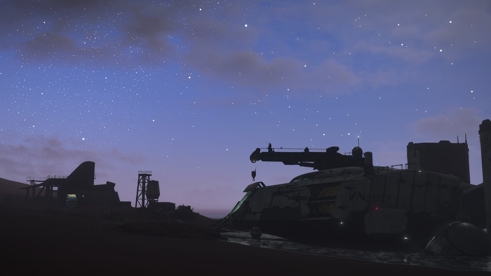

# DHV Magellan

An [Omarchy](https://omarchy.org) theme — a dark, purple-tinted palette
(renamed from the local `dhv` theme to **DHV Magellan**).



- **Mode:** dark
- **Accent:** `#7377b1`
- **Foreground:** `#A5ADD0`
- **Icons:** Yaru-purple

## Install

```sh
omarchy theme install https://github.com/tami1A84/omarchy-dhv-magellan-theme.git
```

This clones the repo into `~/.config/omarchy/themes/dhv-magellan/` and applies it.

To switch to it later:

```sh
omarchy theme set "Dhv Magellan"
```

## Remove

```sh
omarchy theme remove dhv-magellan
```

## Contents

```
colors.toml            Palette used by the shell, terminals and apps
icons.theme            Icon theme (Yaru-purple)
backgrounds/           Wallpaper(s) for this theme
```

## Credits & license

The theme configuration (`colors.toml`, `icons.theme`) is released under the
MIT license — see [LICENSE](LICENSE).

The wallpaper in `backgrounds/` is a screenshot from **DEATH STRANDING 2: ON THE
BEACH** (© Kojima Productions / Sony Interactive Entertainment) and is included
here for personal use only. It is **not** covered by the MIT license and remains
the property of its respective rights holders. Replace it with your own wallpaper
if you intend to redistribute this theme widely.
